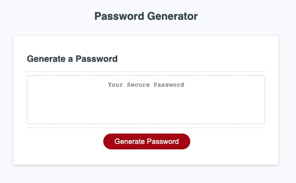

# Password Generator

## Introduction
This was a solo project implemented for UCB Full Stack Bootcamp 2021. The project was to implement a random password generator that takes in a password length and ask user for character types to include (lowercase, uppercase, numeric, and/or special characters). A new password is then generated matching the user's criteria.

Visit the [live demo](https://wendyqnguyen.github.io/wqn-portfolio/)!

## Built With
* HTML
* CSS
* Javascript

## Screenshot

### Deployment

This application is currently deployed on GitHub.

## Contribution
- Wendy Nguyen - [@linkedln](https://www.linkedin.com/in/wenguyen/)

### ©️2021 Wendy Nguyen 
